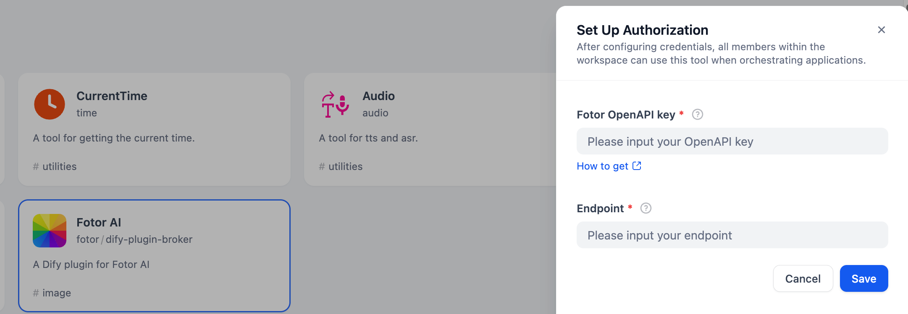
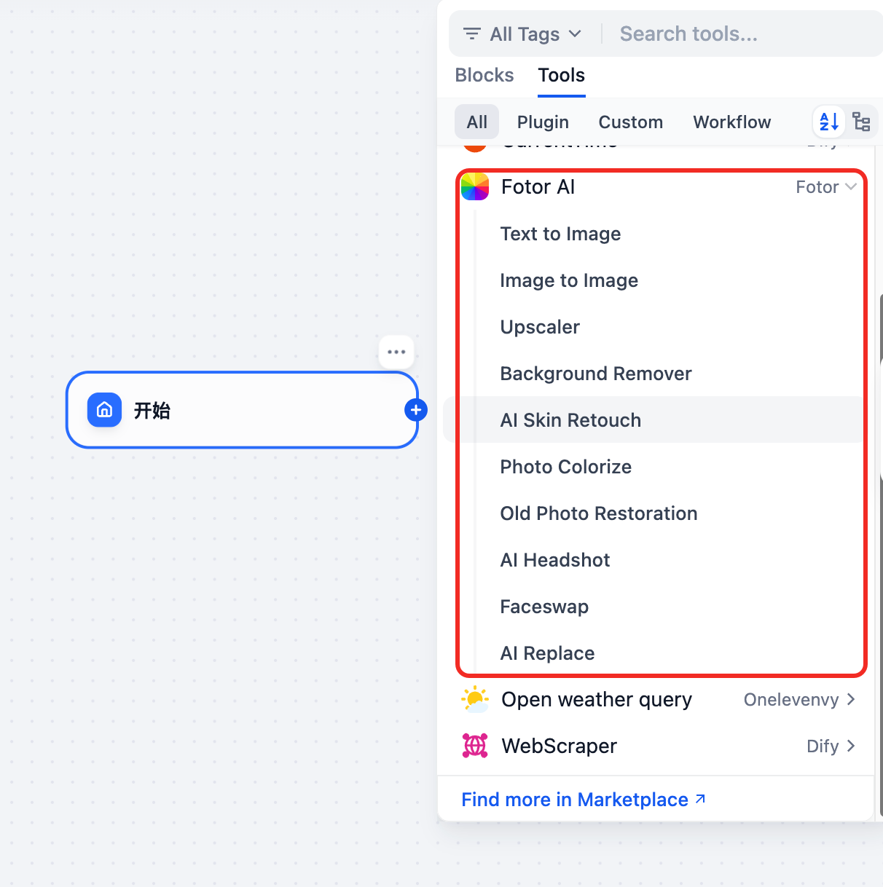
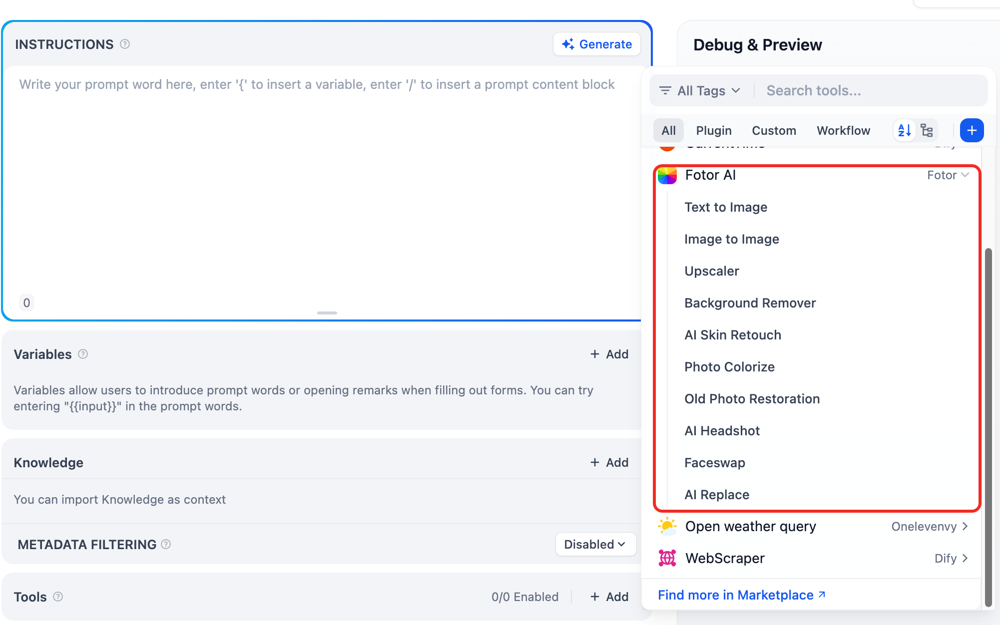

# Fotor AI

## Overview
The Fotor AI plugin integrates Fotor's powerful AI image processing features into Dify. Supported capabilities include text-to-image generation, background removal, image enhancement, AI headshot creation, and more.

---

## Configuration

1. **Apply for a Fotor API Key**  
   Request your API Key from the [Fotor Developer Portal](https://developers.fotor.com/).
2. **Install Fotor AI Tools from the Plugin Marketplace**  
   Search for and install the Fotor AI tools in the Plugin Marketplace.
3. **Configure in Dify**  
   Go to the Dify Tool page, click `Tools > Fotor AI > Authorize`, and enter your API Key.
   
   > **Note:** The API Endpoint can be found in the [Getting Started Guide](https://docs.fotor.com/getting-started/auth).

   

---

## Features

- [Text-to-Image Generation](https://docs.fotor.com/reference/text2img)
- [Image-to-Image Transformation](https://docs.fotor.com/reference/img2img)
- [AI Headshot Generation](https://docs.fotor.com/reference/headshot)
- [Image Upscaling](https://docs.fotor.com/reference/img-upscale)
- [Photo Colorization](https://docs.fotor.com/reference/colorize)
- [Photo Restoration](https://docs.fotor.com/reference/restoration)
- [Background Remover](https://docs.fotor.com/reference/background-remover)
- [AI Skin Retouch](https://docs.fotor.com/reference/retouchskin)
- [Face Swap](https://docs.fotor.com/reference/faceswap)
- [AI Replace](https://docs.fotor.com/reference/replacer)

---

## Usage

### 1. Chatflow / Workflow Applications

- Both Chatflow and Workflow applications support the Fotor AI tool node.

### 2. Agent Applications

- Add the Fotor tool in your Agent application, then simply enter a description in the dialog box to use the tool.